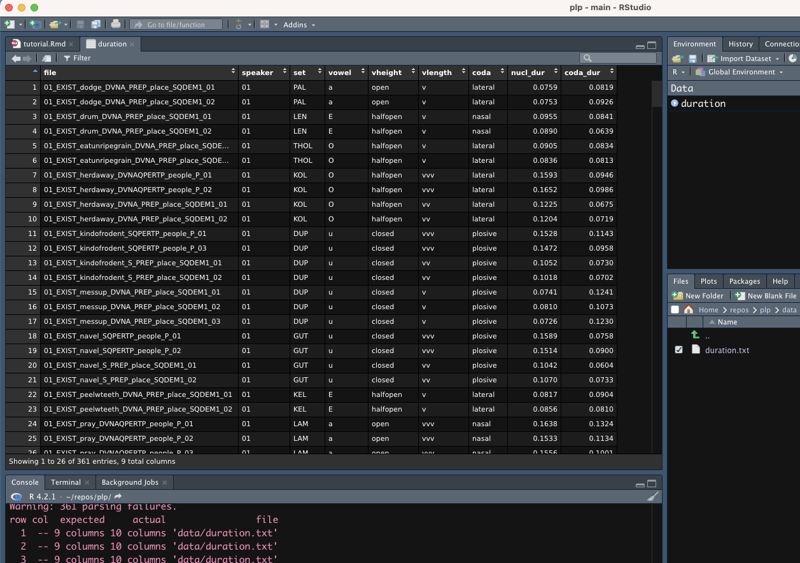

```{r setup, include=FALSE}
knitr::opts_chunk$set(echo = TRUE)
knitr::opts_knit$set(root.dir = here::here())
library(tidyverse)
theme_set(theme_light())
```

<style type="text/css">
body{
  font-size: 12pt;
  color: black;
}
</style>

# Introduction

These instructions explain how to obtain the key descriptive statistics for acoustic measurements using R, both as numerical values and as various types of plots.

**Descriptive statistics** summarise what is going on in the data. If the descriptive statistics are done well in an investigation and the subsequent written report, then it is clear what is going on. As [Russ Lenth](http://homepage.divms.uiowa.edu/~rlenth/), a statistician at the University of Iowa and author of the excellent R package `emmeans` puts it, 

> Failure to describe what is actually going on in the data is a failure to do an adequate analysis. Use lots of plots, and think.

## R and RStudio

[R](http://www.r-project.org) is a programming language used for statistical computing. It is based on the [S](https://en.wikipedia.org/wiki/S_(programming_language)) language and environment which was developed at Bell Laboratories (formerly AT&T, now Lucent Technologies) by John Chambers and colleagues in the 1970s. 

**R is a programming language** in the sense that, instead of using the mouse to select commands from menus, you enter commands either interactively (via a command-line interface) or by executing a script, much as you have been doing with Praat. Like Praat scripting, R takes some getting used to, but for many basic tasks, once you have a template it is straightforward to make small alternations for different data frames or types of plots.

**[RStudio](https://rstudio.com/) is Integrated Development Environment**, or IDE, for R. RStudio allows users to develop and edit programs in R by supporting a large number of statistical packages, higher quality graphics, and the ability to manage your files and more. For example, you can easily have multiple R sessions open at once in a single instance of RStudio. 

Note that RStudio cannot function without R. *Think of R as the engine and RStudio as the console of a car*.


There is a huge amount of information about R and RStudio on the internet, and countless tutorials and introductions you can find via Google or other search engines.

In this document, we will focus on just a few tasks:

- **Importing data** into R.
- Generating numerical **summaries**.
- Making and saving **plots**.

# Getting data into R

R comes with several functions to import, change and plot data. They all do a very good job.

Recently, though, a set of add-on packages have been developed to create a more consistent user experience.

This set of packages is called the **tidyverse**.

When you install R, you only get "base" R, so the tidyverse packages are not installed.

To install them all you can simply run the following:

```{r install-tidy, eval=FALSE}
install.packages("tidyverse")
```

Now the tidyverse packages are installed in the R **library**. The library is the place (generally one folder) where the packages files are installed to.

However, to use packages that are not part of base R, you will have to *attach* them every time you start an R session in RStudio (i.e. every time you launch RStudio).

You attach packages with the `library()` function, like so:

```{r tidyverse}
library(tidyverse)
```


## Data file format

First, have a look at what the `duration.txt` file in the `data/` folder looks like. You can open it in RStudio by clicking on the file name in the `Files` panel.^[This file is a plain text file, so you can open it in an application like Notepad (on a Windows PC) or TextEdit (on a Mac).]

The first few lines will look like this:

```
file speaker set vowel vheight vlength coda nucl_dur coda_dur
01_EXIST_dodge_DVNA_PREP_place_SQDEM1_01 01 PAL a open v lateral 0.0759 0.0819 
01_EXIST_dodge_DVNA_PREP_place_SQDEM1_02 01 PAL a open v lateral 0.0753 0.0926 
01_EXIST_drum_DVNA_PREP_place_SQDEM1_01 01 LEN E halfopen v nasal 0.0955 0.0841 
01_EXIST_drum_DVNA_PREP_place_SQDEM1_02 01 LEN E halfopen v nasal 0.0890 0.0639 
```

This file lists the mean duration of vowels in Shilluk.

Note that the first line of this file, called the **header** lists the names of the columns (or *variables*). These names will be imported into R when we import the file. If your data file doesn't have a header, it's possible to add it from within R, but it's usually simpler to make sure that your data file has a header before you import it.

In this example, the different columns are separated by a "space" character. Characters that separate columns are called **delimiters**. Files with tabular data separated by spaces are called *space-separated values* files, and have either a `.txt` extension or `.tsv`.

Another delimiter is the comma `,`, in which case the file might have the extension `.csv` (for *comma-separated values*). R doesn't really care what delimiter you use, so long as you use it consistently within one file.

## Importing data into R

There are a couple of ways to import the data from the file into R. Importing data means making R being able to read and manipulate the data. Think of this as loading the data in the memory of R.

One way to import data is to select `File > Import dataset > From Text (readr...)` from the menu. This will bring up a file browser and you can navigate to wherever on your computer you saved the file. You will then see an `Import Dataset` dialog with a bunch of options. If you just click `Import`, a new RStudio tab will open showing the data:



You will also see some lines of text have appeared in the Console window:

```r
> duration <- read_table("data/duration.txt")
> View(duration)
```

These lines of code do two things:

1. Read the `data/duration.txt` file, and store it as a **data frame** (more specifically a *tibble*, but never mind for now) named `duration`.
2. Open a tab in RStudio allowing you to inspect the data.

Using the menu command saved us some typing, but helpfully, RStudio shows you the code you would have needed to type to achieve exactly the same result. In this, it's a bit like the `Paste history` command in Praat, except a little more user-friendly. 

Exactly what appears in the `read_table()` command will depend on where your file is and your operating system. But what you can see is that, much like in Praat, the menu item can be translated into a text command.

This is very useful because you can save these commands into a script, and then run the script directly, without having to type all the commands out over and over again. Unlike Praat, however, the RStudio console is *interactive*, meaning you can try commands out in real time and immediately see the results. For instance, we could read the `duration.txt` file in ourselves using the code:

```{r read-duration}
duration <- read_delim("data/duration.txt")
```

If we want to look at the contents of the file directly in the Console, we can just type its name:

```{r duration}
duration
```

This data table is relatively short (only 44 entries), but for larger data tables, viewing the data in this way is impractical. We can either use the `View()` command (note: capitalization is important here), which will open the data in a scrollable tab, or `head()`, which just shows the first few lines:

```{r head}
head(duration)
```

We can add a number after the name of the data object to specific the number of lines:

```{r head-10}
head(duration, 10)
```

The data frame contains the following columns:

- `file`: the name of the recording the measurements are taken from.
- `speaker`: the speaker ID.
- `set`: the set the word belongs to.
- `vowel`: the vowel of which the duration is given (`a`, `E`, `O`, `u`).
- `vheight`: the height of the vowel (`open`, `halfopen`, `closed`).
- `vlength`: the phonological length of the vowel (`v`, `vv`, `vvv`; or short, long, overlong).
- `coda`: the manner of articulation of the coda consonant (`lateral`, `nasal`, `plosive`).
- `nucl_dur`: the duration of the vowel in seconds.
- `coda_dur`: the duration of the coda consonant in seconds.

Before moving on, let's transform the durations from seconds to milliseconds (segment durations are usually reported and analysed in milliseconds because they tend to be always smaller than a second).

```{r mutate}
duration <- duration %>%
  mutate(
    nucl_dur = nucl_dur * 1000,
    coda_dur = coda_dur * 1000
  )
```


# Numerical summaries

The most common acoustic measurements (e.g. segment durations, fundamental frequency (f0), formant values etc.) are numeric variables that can only take on positive numbers and they generally cannot be `0`. If a vowel has a duration of 0 ms, then there is no vowel.

The descriptive statistics that are most appropriate for such variables are the **mean** and the **median** (two *measures of central tendency*) and the **standard deviation** (a *measure of dispersion* around the mean).

There are a number of ways you can calculate these in R.

The first is with the `summary` function:

```{r summary}
# The dollar sign $ is a way of accessing just one specific column,
# In this case the nucl_dur colum
summary(duration$nucl_dur)
```

Here we see both the median and the mean, in addition to the highest (`Max.`) and lowest (`Min.`) values, and the 1st and 3rd **quartiles**, which are the middle numbers between the median and the minimum or maximum, respectively.

Another way to get these values is to ask for them explicitly, using the functions `mean()`, `median()`, `range()` or `min()` and `max()` and `sd()` (for standard deviation):

```{r mms}
mean(duration$nucl_dur)
median(duration$nucl_dur)
sd(duration$nucl_dur)
```

A function normally takes one or more **arguments** (the things you put between the parentheses).

The argument in the three functions above has three parts. First is the name of the data object we're interested in (in this case, the data frame `duration`). The dollar sign `$` is a way of saying "just return a single column of the named data frame". Then, we put the name of that column to the right of the `$`. So here, we're asking for the `nucl_dur` column of the `duration` data frame.

For some columns, it doesn't make sense to ask for a quantity like the mean, and R will quite reasonably complain:

```{r string}
mean(duration$coda)
```

To get more information about the arguments that a function takes, you can always use the built-in manual pages by prefacing the function with a question mark `?`:

```{r help, eval=FALSE}
?mean
```


## Group data with `group_by()`

OK, so we can get descriptive statistics for the entire data frame. But what if we want to know, say, the mean and standard deviation of vowel duration by vowel?

`group_by()` allows us to group data based on some columns. We can use the grouping to calculate summary statistics for each group.

For example, to calculate the mean vowel duration for each vowel in our data:

```{r dur-summ}
dur_summ <- duration %>%
  group_by(vowel) %>%               # this is called a "pipe", see below
  summarise(
    # COLUMN_NAME = FUNCTION
    dur_mean = mean(nucl_dur),
    dur_sd = sd(nucl_dur)
  )

dur_summ
```

Let's unpack that.

We start with the data `duration` and we pipe it (`%>%`) into `group_by()`.
The `group_by()`function takes that data groups the rows by `vowel`.
Note that this is done "under the hood" so you don't really see the effects of grouping until you do something with the grouped data.

What's that weird thing now, `%>%`? 

That is called a **pipe**. A pipe is a symbol that tells R to pass whatever the function before it spits out onto the function that follows it, so you don't have to specify the data in the following function. It works like a pipe, a tube that brings water from a tank to your sink, for example.

Think of the pipe as a "teleporter": it just teleports the output of one function onto the next.

Then we use the `summarise()` function to get numerical summaries of the grouped data frame. This function requires you to specify the name of the new columns that will hold the summary results and the functions to calculate the summaries.

Note that now you can specify an existing column name directly, without having to use the `$` syntax as we did at the beginning.

The output of the code now has a `dur_mean` and a `dur_sd` column, with the duration mean and standard deviation for the vowels /a, E, O, u/ in separate rows.

You get means and standards deviations for the four vowels because we grouped the data by vowel with `group_by()`.
Note that we are saving the output of the summarise operation into a new variable `dur_summ`.

You can round the mean and standard deviation values by using the `round()` function (check the documentation).

```{r dur-summ-1}
dur_summ_1 <- duration %>%
  group_by(vowel) %>%               # this is called a "pipe", see below
  summarise(
    dur_mean = round(mean(nucl_dur)),
    dur_sd = round(sd(nucl_dur))
  )

dur_summ_1
```

**Exercise.** Try the `summarise()` function but this time group by `vlength` and get mean duration and standard deviation. Round the values.

```{r ex-summ, eval=FALSE}
duration %>%
  group_by(...) %>%
  summarise(
    ...
  )
```


If you want to group by multiple columns, not just one, you simply add all the column names you want, separated by a comma `,`, in `group_by()`.

```{r dur-summ-2}
dur_summ_2 <- duration %>%
  group_by(vowel, vlength) %>%
  summarise(
    dur_mean = round(mean(nucl_dur)),
    dur_sd = round(sd(nucl_dur)),
    obs_n = n() # number of observations per group
  )

dur_summ_2
```

*Tip*: When you start collecting your R commands into scripts, it's usually best to put all the `library()` calls at the very beginning of the script, so that all the functions in those package libraries are available for the rest of the script.

Now that the package is loaded, you can use all of the functions it provides.

# Plotting data

There are different ways to generate plots in R, using both the base (built-in) graphics as well as packages such as `lattice` or `ggplot2`.

In this tutorial, we'll make use of the `ggplot2` package. Once again, there are many, many online resources related to `ggplot2`; [ggplot2.tidyverse.org](https://ggplot2.tidyverse.org/) is a good place to start.

## Strip charts

Strip charts are a basic type of plot that works very well when you have a mix of numeric and categorical variables, as we do here (`duration` is numeric and `vlength` is categorical).

Let's start off with a minimal strip chart.

As a first simple example, let's just plot vowel duration by `vlength`.

```{r strip-chart}
ggplot(data = duration, mapping = aes(vlength, nucl_dur)) +
  # try width values 0.2, 0.5, 0.8 to see what the argument does
  geom_jitter(width = 0.1)
```

Awesome!

There's a lot going on in here, though. Let's unpack the syntax of this function call a little bit.

The heart of the code is the `ggplot()` function itself (note that there's no `2` in the function name, as opposed to the name of the package `ggplot2`).

A call to `ggplot` takes at least two arguments. The first, `data`, is the data frame containing the columns of information we're going to use. The second, `mapping`, is used to "map" data to so-called *aesthetics*.

**Aesthetics** are visual aspects of the graph, like axes, colour, and labels. You specify aesthetics using the `aes()` function.

The most common aesthetics are the `x` and `y` axes (not that some plots take only `x` and some other also have `z`). In the plot above we are mapping the `x`-axis to `vlength` and the `y`-axis to `nucl_dur` (i.e. vowel duration).

Once you have specified the data and the data-to-aesthetics mapping, you can add *geometries*.

**Geometries** are the shapes, text, labels, lines, etc, that represent the individual data points in the plot. The strip chart plot uses the "jitter" geometry. The function for the jitter geometry is simply `geom_jitter()` (`geom` is short for geometry).

Most times it's sufficient to include a `geom_*()` function without arguments (within the parentheses). Here, we specified the argument `width`.

**Exercise**: Try different values for the argument `width` to see what it does.

Note that all the component functions in a ggplot are concatenated together with a plus `+` sign.^[You don't need to start a new line after the different components of the function call. R doesn't care if the entire thing is written on one line. But since RStudio understands the `ggplot2` syntax, it auto-indents for you in a way that can make the call much more readable for humans, which can help to catch errors and also to make changes later.]

It's OK for now if you don't fully understand all the components of the syntax. The important thing is to see where the different parts of the data appear. You can then copy and paste this basic template and substitute the relevant columns from your own data until you get comfortable with the syntax.

## Faceting 

To visualise subsets of data, you can use **faceting**.

Faceting creates separate panels (of facets) based on a specified column. Here, we can facet the VOT data by `vowel`.

```{r facet}
ggplot(
  data = duration,
  mapping = aes(x = vlength, y = nucl_dur)
) +
  # Can you guess what the alpha argument does?
  geom_jitter(width = 0.1, alpha = 0.5) +
  facet_grid(~ vowel)
```

**Exercise**. Fill in the code below to have `vowel` on the *x*-axis and faceting by `vlength`.

```{r facet-2, eval=FALSE}
ggplot(
  data = duration,
  mapping = aes(x = ..., y = nucl_dur)
) +
  geom_jitter(width = 0.1) +
  facet_grid(~ ...)
```

## Histograms and density plots

For many acoustic measurements, such as segment duration, it is often very useful to visualize the **distribution** of the data in the form of a histogram or a density plot. 

In a **histogram**, the values of interest are grouped into different ranges, or *bins*, and the height of each bar indicates the number of data points that fall into that bin.^[Do not mix up histograms and bar plots. They are different!]

The number of bins is what's called a *free parameter*. The user has to select a value for it, and the resulting visualization depends to some extent on the value chosen. `ggplot()` will select a default value, but this isn't necessarily the appropriate one for the chosen data frame (though the defaults are often pretty sensible).

A **density plot** is similar to a histogram, but it uses a mathematical trick to interpolate values over a continuous range, rather than using bins. One advantage of a density plot is that its shape isn't affected by the number of bins chosen (since there are no bins).

Both histograms and density plots are easy to generate with `ggplot()`. You just need to use the relative geometries: `geom_histogram()` and `geom_density()`.

```{r histogram}
duration %>%
  ggplot(aes(x = nucl_dur)) +
  # Try different numbers of bins
  geom_histogram(bins = 60)
```

```{r density}
duration %>%
  ggplot(aes(x = nucl_dur)) +
  geom_density() +
  # geom_rug() adds ticks for each observation beneath the density
  geom_rug()
```

Both calls have a very similar form, and differ in similar ways from the previous function calls.

In the mapping specification with `aes()`, we only need to specify an *x*-axis variable, in this case `nucl_dur`.

In these basic plots, we don't have to supply any arguments to the geometries we use (`geom_histogram()` or `geom_density()`, respectively).

However, when we make a histogram, we get a message suggesting that we change the value of `binwidth`. You can do this by specifying the `binwidth` argument inside of `geom_histogram()`. Try a few different values and see what happens. What do you think is a sensible value for this data frame?

When making a density plot that isn't faceted, it can sometimes be hard to see all the different plots if they are stacked on top of one another. You can make them semi-transparent by including an `alpha =` argument to `geom_density`. Try `alpha = 0.5` to get an idea of this behaviour.

```{r density-1}
duration %>%
  ggplot(aes(x = nucl_dur, fill = vlength)) +
  geom_density(alpha = 0.5) +
  geom_rug() +
  facet_grid(vowel ~ .)
```


Note that it is **not** appropriate to throw away outliers just for being outliers! There could well be some good reason why these tokens have a longer VOT, and if so, you want to know what that is. The point here is simply that not all relevant aspects of the data are necessarily revealed in a single graphical visualization (or descriptive statistic, for that matter). Once again: use lots of plots, and think.

## Violin plots

Another type of plot is the **violin plot**.

Violin plots are just a different way of representing densities, like in density plots.
It's easier to understand if you just have a look at a violin plot.

```{r violin}
duration %>%
  ggplot(aes(x = vowel, y = nucl_dur, fill = vlength)) +
  geom_violin()
```

Basically each "violin"-looking shape is a mirrored vertical density curve.

The nice thing about violin plots is that you can visualise the distribution of the data like in a density plot but without being burdened by the individual data points and in a strip chart (actually, you could add a strip chart on top of violin plots if you wanted to, but we won't do this in this tutorial).

We can add the mean duration for each vowel and vowel length like so:

```{r violin-1}
duration %>%
  ggplot(aes(x = vowel, y = nucl_dur, fill = vlength)) +
  geom_violin() +
  geom_point(
    data = dur_summ_2,
    aes(y = dur_mean),
    position = position_dodge(width = 0.9),
    size = 3, shape = 17
  )
```

Remember the `dur_summ_2` data frame with the means we calculated above?

Now you can use that to add the means to the violin plot!
You simply specify the `data` argument in `geom_point()` so that the point geometry uses `dur_summ_2` rather than `duration`.

## Saving plots

If you want the plots to be automatically saved to disk, you can use `ggsave()`. See the help page `?ggsave` for more information.

Minimally, you need to specify a file path, i.e. the location where you want the plot to be saved and the name of the file.

By default, `ggsave()` will save the last generated plot.

```{r ggsave, eval=FALSE}
duration %>%
  ggplot(aes(x = vowel, y = nucl_dur, fill = vlength)) +
  geom_violin()

ggsave("img/violin.png")
```

But you can specify a plot if you assign the plot into a variable:

```{r ggsave-p}
violin_1 <- duration %>%
  ggplot(aes(x = vowel, y = nucl_dur, fill = vlength)) +
  geom_violin() +
  geom_point(
    data = dur_summ_2,
    aes(y = dur_mean),
    position = position_dodge(width = 0.9),
    size = 3, shape = 17
  )

# You can specify the width and height in inches
ggsave("img/violin-1.png", plot = violin_1, width = 7, height = 5)
```

# Other things you can do

This tutorial only scratches the surface of what you can do with R and `ggplot2`. There are many online tutorials and resources that you can use to learn how to modify and customize your plots further (the [Cookbook for R](http://www.cookbook-r.com/) is often a good place to start). Here I'll list just a few very commonly requested modifications:

## How do I change the plot background?

Try adding `+ theme_minimal()` or `+ theme_dark()` to the end of your function call. Look at e.g. `?theme_minimal` for a complete list of themes.

## How do I change the axis labels? 

There are two ways to do this. The first way is to rename the columns themselves. But we won't use that here.

The second way is to specify the labels with the `labs()` function:

```{r labs}
ggplot(
  duration,
  aes(x = vlength, y = nucl_dur, colour = vlength)
) +
  geom_jitter(width = 0.1) +
  facet_grid(~ vowel) +
  labs(
    x = "Vowel length",
    y = "Vowel duration (ms)",
    colour = "Vowel\nlength",
    # You can also add title, subtitle, and caption
    title = "Vowel duration by vowel quality and legnth"
  )
```

## How do I change the order in which factor levels appear? 

R defaults to alphabetic/numeric order, but oftentimes we might want to change this (for instance, it might make more linguistic 'sense' for the consonants to be ordered by place of articulation from most to least proximal, i.e. labial - coronal - dorsal).

To do this, we have to explicitly change the order in the underlying data frame.

We can do it with the `mutate()` function.

```{r mutate-fct}
mutate(
  duration,
  vowel = factor(vowel, levels = c("u", "O", "E", "a"))
) %>%
  ggplot(aes(x = vowel, y = nucl_dur, fill = vlength)) +
  geom_violin() +
  geom_point(
    data = dur_summ_2,
    aes(y = dur_mean),
    position = position_dodge(width = 0.9),
    size = 3, shape = 17
  )
```
